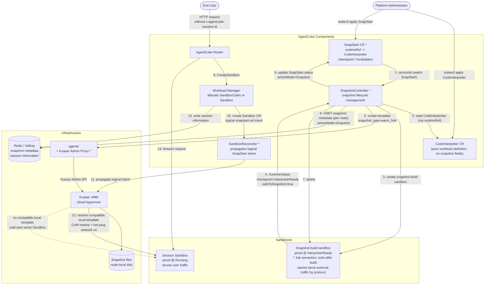

# AgentCube SnapStart Design

> Status: Draft
> Version: v0.1

---

## 1. Background and Motivation

AgentCube currently creates a sandbox from cold state for every session:
create -> wait for Ready -> handle requests -> destroy by TTL/idle GC.

| Runtime type | Cold-start bottleneck | Typical latency breakdown |
|---|---|---|
| Code Interpreter | VM boot + picod startup + package imports | VM: 0.3-0.5 s / picod kernel: 2-5 s / numpy+pandas: 1.5-5 s |
| Browser Agent | VM boot + Chromium startup + CDP readiness | VM: 0.3-0.5 s / Chromium: 3-8 s / CDP: 1-3 s |

> **Data sources** (baseline: cloud-hypervisor VMM, excluding Kubernetes scheduling latency)
>
> - **VM boot 0.3-0.5 s**: Kuasar's benchmark report for cloud-hypervisor v28.2 measured serial sandbox startup at 300-360 ms, roughly one third of Kata Containers v2.5.2 on the same hardware. Source: [Kuasar Benchmark Test Report](https://kuasar.io/blog/benchmark-test-report/).
> - **numpy + pandas 1.5-5 s**: Python community reference values put unconstrained cold imports around 100 ms for numpy and around 200 ms for pandas; the table estimates a 5-10x amplification under 100-300 mCPU microVM limits. This is an illustrative estimate, not a strict benchmark. Actual latency depends on Python version, numpy/pandas versions, and host I/O. Replace this with Phase 1 measurements after implementation. Source: [PEP 810 lazy-import analysis](https://byteiota.com/python-lazy-imports-speed-up-startup-with-pep-810/).
> - **Chromium headless 3-8 s**: Chrome documentation and community benchmarks put unconstrained headless startup around 800 ms-1.2 s; the table estimates a 4-6x amplification under 200-500 mCPU limits. Sources: [Chrome Headless documentation](https://developer.chrome.com/docs/chromium/headless), [WebScraping.AI headless performance comparison](https://webscraping.ai/faq/headless-chromium/what-are-the-performance-differences-between-headless-chromium-and-other-browsers).
> - **Snapshot restore reference**: Modal reports CRIU copy-mode memory snapshots with p50 1.05 s for an `import torch` case, compared with roughly 5 s cold start. AWS Lambda SnapStart documents sub-second startup qualitatively but does not publish millisecond-level p50/p99 numbers. For a 256 MB picod snapshot on local SSD with copy mode, this design estimates roughly 0.5-1.5 s. Sources: [Modal Memory Snapshots](https://modal.com/blog/mem-snapshots), [AWS Lambda SnapStart documentation](https://docs.aws.amazon.com/lambda/latest/dg/snapstart.html).

The key point is that VM boot is no longer the dominant bottleneck. With cloud-hypervisor, VM boot can be around hundreds of milliseconds; the user-visible delay mostly comes from runtime initialization: package imports, kernel startup, Chromium startup, CDP readiness, font/certificate initialization, and similar work.

This design uses Kuasar **WarmForkSnapshot**. A runtime is initialized once, reaches a ready-waiting checkpoint, and is snapshotted. Later sessions restore from that checkpoint. The target is to reduce session startup latency from **5-12 s to 0.5-2 s**.

**Support scope**: SnapStart only supports the Kuasar VMM path with the cloud-hypervisor backend. It does not support Kata Containers or other VMM implementations. WarmForkSnapshot is a Kuasar-specific process-level memory snapshot protocol based on an inject socket and copy-on-write clone. If a cluster mixes VMM implementations, SnapStart only applies to CodeInterpreter / AgentRuntime workloads using a Kuasar RuntimeClass; other workloads automatically fall back to cold start.

---

## 2. Kuasar Capability Fit

Kuasar exposes three snapshot types. Their value for AgentCube differs significantly.

### 2.1 EnvironmentSnapshot

EnvironmentSnapshot captures a booted VM and prepared environment, but no running runtime process. After restore, the container still starts from the image entrypoint.

| Aspect | Assessment |
|---|---|
| Saved latency | Only VM boot, around 0.3-0.5 s. Runtime initialization still runs again. |
| Suitable workload | Lightweight runtimes whose startup is already below 1 s and whose bottleneck is pure VM boot. |
| Code Interpreter | Not suitable. The bottleneck is package import and kernel startup. |
| Browser Agent | Not suitable. The bottleneck is Chromium startup and CDP readiness. |

Conclusion: EnvironmentSnapshot has limited user-visible value for AgentCube. It can be used in the first part of Phase 1 to validate the restore transaction model, network hot-plug, and Kuasar Admin API integration, but it is not the main acceleration feature.

### 2.2 WarmForkSnapshot

WarmForkSnapshot captures a process in a ready-waiting state. After restore, Kuasar injects instance-specific identity and task context. Each restored instance receives an independent copy-on-write memory view and an independent network namespace.

| Aspect | Assessment |
|---|---|
| Saved latency | VM boot plus all runtime initialization. |
| Code Interpreter | Core target. picod waits at `InterpreterReady`; restore injects `session_id` and workspace. |
| Browser Agent | Core target. Chromium and the Browser Agent wait at `BrowserReady`; restore injects start URL, proxy, identity, and workspace. |
| Sharing model | One template lease can serve many restores; each instance gets independent memory and runtime state. |

Conclusion: WarmForkSnapshot is the core mechanism and should be the first user-visible SnapStart capability.

### 2.3 ContinuationSnapshot

ContinuationSnapshot preserves a full process state and network identity. It is consumed one-to-one and is closer to pause/resume for an existing session.

| Aspect | Assessment |
|---|---|
| Suitable workload | Suspend/resume for the same user and same long-running agent session, preserving variables, runtime state, workspace state, and in-flight task context. |
| Saved cost | Releases idle sandbox memory while the agent is blocked on LLM generation, external tools, or user confirmation. |
| Cost | Requires per-session artifact ownership, CNI-level network identity control for cross-node restore, strong access control, and strict lifetime management; implementation complexity is high. |
| Sharing model | One snapshot belongs to one session only. It must never be inserted into the shared SnapStart template pool. |

This is valuable for agent workloads whose execution is intermittent inside a single long session. For example, an agent may execute step A inside a sandbox, call an LLM, then wait several seconds for token generation or a tool-planning response. It may also pause for minutes while waiting for the user to approve a destructive action, provide credentials, choose an option, or confirm that the next step should proceed. During those gaps the sandbox may be completely idle from a CPU perspective, but it still holds VM memory, browser memory, Python heap, workspace caches, and agent context. A continuation snapshot can suspend that sandbox into a session-private artifact, destroy the running sandbox to reclaim memory, and later restore the same session when the LLM returns or the user speaks again.

ContinuationSnapshot therefore optimizes a different axis from SnapStart:

| Mechanism | Primary goal | State allowed in snapshot | Reuse scope |
|---|---|---|---|
| WarmForkSnapshot / SnapStart | Fast startup for many new sessions | Clean runtime state before user input | Shared across many sessions |
| ContinuationSnapshot | Reduce idle memory cost for one existing session | User/session state, agent memory, workspace, and task context | Same session only |

The contamination rules are intentionally opposite. SnapStart snapshots must reject user state because they are shared templates. Continuation snapshots exist precisely to preserve user state, so they require a different security model: the artifact must be bound to `sessionID`, user, tenant, runtimeRef, and restore generation; restore must verify ownership before use; artifacts should be encrypted or stored in a trusted node-local / distributed backend; and deletion must follow session TTL, max continuation age, and explicit user/session cleanup.

ContinuationSnapshot is out of scope for the current SnapStart design because this document focuses on reusable startup templates. It should be evaluated as a separate future **session suspend/resume** feature. The two features can share lower-level Kuasar restore plumbing, but they should not share CRD status, Redis keys, template keys, warm pool accounting, or restore selection logic without an explicit abstraction boundary.

### 2.4 Memory Restore Mode

Kuasar supports restore modes such as `copy`, `ondemand`, `filebackend`, and `externaluffd`. These are infrastructure-level tuning choices. AgentCube does not expose them in the SnapStart API.

---

## 3. Key Design Decisions

### 3.1 Decision Summary

| Decision point | Choice | Rationale |
|---|---|---|
| Primary snapshot type | WarmForkSnapshot | It removes runtime initialization latency, the real bottleneck. |
| Phase 1 bootstrap type | EnvironmentSnapshot first, then WarmForkSnapshot | Validates the restore path before picod changes are complete. |
| ContinuationSnapshot | Out of scope for SnapStart; future session suspend/resume feature | Valuable for reclaiming idle memory in long agent sessions, but it preserves user/session state and therefore needs a separate ownership, security, lifecycle, and restore model. |
| Memory restore mode | Not exposed | Managed globally by Kuasar infrastructure. |
| API shape | Independent `SnapStart` CRD | Snapshot lifecycle, finalizers, per-node metadata, build jobs, and GC deserve a separate resource. |
| Snapshot construction | Job-like controller semantics | Snapshot build is asynchronous, retryable, observable, and stateful. |
| WarmPool interaction | Orthogonal layers | SandboxWarmPool is an AgentCube allocation policy. SnapStart is a Kuasar sandbox-start optimization. A claimed warm Pod is already running and is never restored again; SnapStart may accelerate newly created refill sandboxes. |
| Snapshot storage | Artifact-aware model; node-local backend in Phase 1 | Phase 1 stores Kuasar templates on node-local disk, but API/status and metadata model the result as a snapshot artifact plus restore placement so future Kuasar cross-node distribution can fit without changing the user-facing SnapStart API. |
| Lifecycle cleanup | Finalizer + two-phase metadata + annotation-triggered rebuild | Covers deletion, orphan cleanup, and manual rebuild. |

### 3.2 API Shape: Embedded Field vs. Independent SnapStart CRD

Industry systems differ because their deployment boundaries differ:

| Product | Mechanism | Independent runtime definition | Snapshot optional | Independent snapshot resource |
|---|---|---|---|---|
| [AWS Lambda SnapStart](https://docs.aws.amazon.com/lambda/latest/dg/snapstart.html) | Firecracker microVM memory/disk snapshot for published function versions | No; function version is the deployment unit | Yes | No; the snapshot is managed behind the function version |
| [E2B Templates / Sandbox Snapshots](https://e2b.dev/docs/sandbox/snapshots) | Template build snapshots plus running-sandbox filesystem/memory snapshots | Yes; templates define reusable sandbox environments | Yes; a sandbox can start from a template or from a snapshot ID | Yes; sandbox snapshots have snapshot IDs and list/delete APIs |
| [Daytona Snapshots](https://www.daytona.io/docs/en/snapshots/) | Docker/OCI image-backed sandbox snapshots/templates | No independent cold runtime path; snapshots are the sandbox template entrypoint | No; sandboxes use a default or custom snapshot | Yes |
| [Modal Functions Memory Snapshots](https://modal.com/docs/guide/memory-snapshots) | Container memory snapshot for deployed Functions | No; function is the deployment unit | Yes | No for Function Memory Snapshots |
| [GKE Agent Sandbox](https://docs.cloud.google.com/kubernetes-engine/docs/how-to/agent-sandbox) | Kubernetes Pod warm pool | Yes, via SandboxTemplate | N/A | N/A |
| AgentCube | Kuasar WarmForkSnapshot | Yes, CodeInterpreter / AgentRuntime can cold start | Yes | Yes |

AgentCube differs from Lambda SnapStart and Modal Functions Memory Snapshots because CodeInterpreter / AgentRuntime remain valid runtime definitions without SnapStart. It also differs from Daytona's snapshot-first sandbox model because SnapStart is optional rather than the sandbox template entrypoint. E2B already exposes both templates and independent sandbox snapshots, but its API boundary is sandbox/template centric; AgentCube keeps Kubernetes runtime resources as the primary workload definitions and layers SnapStart on top. This favors a separate Kubernetes resource.

Embedding snapshot fields into CodeInterpreter would mix workload definition with snapshot lifecycle. A snapshot has its own state machine, finalizer, build job, per-node artifacts, invalidation behavior, and orphan cleanup. A dedicated `SnapStart` CRD keeps responsibilities separate.

### 3.3 Candidate API Shapes

**Option A: Embedded field in CodeInterpreter / AgentRuntime**

```yaml
apiVersion: runtime.agentcube.volcano.sh/v1alpha1
kind: CodeInterpreter
metadata:
  name: python-interpreter
spec:
  sessionStartup:
    mode: Snapshot
    checkpoint: InterpreterReady
```

This is compact but makes the workload object responsible for snapshot lifecycle and finalizer cleanup.

**Option B: CodeInterpreter references SnapStart**

```yaml
apiVersion: runtime.agentcube.volcano.sh/v1alpha1
kind: CodeInterpreter
metadata:
  name: python-interpreter
spec:
  snapStartRef:
    name: python-snapstart
```

This introduces a separate object, but the runtime object still becomes snapshot-aware.

**Option C: SnapStart references runtimeRef**

```yaml
apiVersion: runtime.agentcube.volcano.sh/v1alpha1
kind: SnapStart
metadata:
  name: python-snapstart
spec:
  runtimeRef:
    kind: CodeInterpreter
    name: python-interpreter
  checkpoint: InterpreterReady
```

This is the selected option. CodeInterpreter stays a pure workload definition. SnapStart owns snapshot lifecycle and refers to the runtime.

### 3.4 Snapshot Build Job Semantics

Snapshot construction is treated like a job:

1. Read the referenced runtime.
2. Compute the normalized spec hash from runtime spec, checkpoint, and protocol version.
3. Create a build sandbox.
4. Wait for the build sandbox / Pod to become Running and read the resolved image digest.
5. Compute the final template key from image digest, checkpoint, and spec hash.
6. Wait until the runtime reaches the requested checkpoint.
7. Ask Kuasar to create the template.
8. Write metadata using a two-phase protocol.
9. Update `SnapStart.status`.

The controller must expose build phase, active mode, invalidation reason, per-node availability, and failure details.

### 3.5 SnapStart and WarmPool

Kubernetes SandboxWarmPool and SnapStart solve different problems at different layers:

| Mechanism | Layer | What is pre-created | Main cost | Main benefit |
|---|---|---|---|---|
| SandboxWarmPool | AgentCube | Scheduled Pod / sandbox slot | Full Pod resources per warm slot | Avoids session-time scheduling and sandbox startup delay |
| SnapStart | Kuasar | Runtime memory template | Snapshot storage and restore cost | Avoids runtime initialization delay when Kuasar starts a new sandbox |

SnapStart and `CodeInterpreter.spec.warmPoolSize` are orthogonal and may be enabled together. There is no AgentCube-level ordering such as `SnapStart -> SandboxWarmPool -> cold start`. The ownership boundary is:

| Decision | Owner | Rule |
|---|---|---|
| Reuse an existing warm Pod | AgentCube SandboxWarmPool controller | If a ready warm slot exists, bind the `SandboxClaim` to that already-running Sandbox. |
| Create a new Sandbox | AgentCube | A direct non-WarmPool request creates a normal Sandbox. SandboxWarmPool keeps the existing claim path and creates normal refill Sandboxes in the background when ready capacity is below target. |
| Restore or cold-start a newly created Sandbox | Kuasar | Kuasar uses a compatible SnapStart template when available; otherwise it cold-starts the same Sandbox. |

A Sandbox obtained from SandboxWarmPool must not be restored again. It is already running before the user claim is bound, so there is no VM startup stage at which restore can occur. This is enforced by the following invariants:

1. `SandboxClaim` allocation does not append snapshot restore annotations.
2. A claimed warm Sandbox does not execute a second Kuasar start or restore transaction.
3. SnapStart intent applies only when Kuasar starts a newly created Sandbox.
4. SandboxWarmPool refill Sandboxes may use SnapStart during their initial Kuasar startup, then enter the pool as ordinary ready warm slots.

This allows the mechanisms to compose without duplicate startup work:

```text
SandboxWarmPool hit
  -> AgentCube binds an already-ready Sandbox
  -> no Kuasar restore occurs

Direct Sandbox create or SandboxWarmPool background refill
  -> AgentCube creates a new Sandbox
  -> Kuasar restores from a compatible SnapStart template when possible
  -> otherwise Kuasar cold-starts the Sandbox
```

This design does not introduce a separate Kuasar-layer SnapStart WarmPool. SandboxWarmPool already owns pre-created Sandbox capacity, and its background refill can use SnapStart to reduce startup cost. A second pool would duplicate capacity management and require separate precedence, quota, reclamation, observability, and failure-recovery semantics without sufficient value.

The user-facing API does not expose a node-local Kuasar template ID. A platform administrator enables SnapStart by creating a `SnapStart` object whose `spec.runtimeRef` points to a runtime. When AgentCube creates a new Sandbox for that runtime, it automatically propagates a logical SnapStart intent, such as `agentcube.volcano.sh/snapstart-ref: <namespace>/<snapstart-name>`. Kuasar resolves that logical reference to a compatible template available on the actual startup node. A Kuasar template ID is node-local implementation metadata and must never be supplied by an end user.

### 3.6 High-Level Architecture



Legend: `*` marks components or capabilities added or extended by this design, including SnapshotController, SandboxReconciler, and the agentd Kuasar Admin Proxy. Steps 1-8 are the control-plane snapshot build flow, which has one-shot job semantics. Steps 9-14 are the data-plane fast session creation path. Dashed edges are the cold-start fallback path. Redis writes use Hash format, such as `HSET snapshot:{ns}:{name} {node_name} {...}`, so per-node restore placements can coexist for one snapshot artifact.

Key design characteristics: CodeInterpreter remains a pure workload definition, while snapshot acceleration is layered through an independent SnapStart object. Both the restore path and the cold-start path go through Sandbox CR -> SandboxReconciler -> Kuasar. AgentCube automatically propagates only a logical SnapStart intent for a newly created Sandbox. Kuasar resolves the node-local template ID internally after placement and cold-starts the same Sandbox when no compatible template exists. The agentd Admin Proxy participates only in control-plane template operations such as `create-template` and `delete-template`; it is not on the session creation data path.

Main components:

| Component | Responsibility |
|---|---|
| `SnapStart` CRD | User-facing snapshot acceleration configuration and status. |
| SnapshotController | Builds templates, tracks status, handles invalidation and GC. |
| Workload Manager | Creates sessions and preserves the existing SandboxWarmPool allocation decision. |
| SandboxReconciler | Propagates the automatically generated logical SnapStart intent for a newly created Sandbox. |
| Kuasar | Resolves a compatible node-local template ID during Sandbox startup, restores when possible, and otherwise cold-starts the same Sandbox. |
| agentd Kuasar proxy | Provides node-local access to Kuasar Admin API through a controlled HTTP proxy. |
| Store / Redis | Stores snapshot artifact metadata, local template IDs, and per-node restore availability. |
| Runtime process | Implements ready-waiting status and inject socket protocol. |

---

## 4. End-to-End User Flows

### 4.1 Flow A: Platform Administrator Enables SnapStart

The runtime remains a normal workload definition:

```yaml
apiVersion: runtime.agentcube.volcano.sh/v1alpha1
kind: CodeInterpreter
metadata:
  name: python-interpreter
spec:
  ports:
    - pathPrefix: "/"
      port: 8080
      protocol: HTTP
  template:
    image: ghcr.io/volcano-sh/picod:latest
    imagePullPolicy: IfNotPresent
    args:
      - --workspace=/workspace
      - --preload=numpy,pandas,matplotlib
    resources:
      requests:
        cpu: "100m"
        memory: "256Mi"
      limits:
        cpu: "1"
        memory: "1Gi"
  sessionTimeout: "15m"
  maxSessionDuration: "8h"
```

SnapStart is configured as a separate object:

```yaml
apiVersion: runtime.agentcube.volcano.sh/v1alpha1
kind: SnapStart
metadata:
  name: python-snapstart
spec:
  runtimeRef:
    kind: CodeInterpreter
    name: python-interpreter
  checkpoint: InterpreterReady
  artifact:
    distribution: NodeLocal
  invalidation:
    onImageDigestChange: true
    onArgsChange: true
    maxAge: 24h
```

The controller builds templates on every eligible node and updates status. A Phase 1 eligible node is Ready, has `agentcube.volcano.sh/kuasar-snapstart=true`, and satisfies the referenced runtime's scheduling constraints. The artifact is backed by node-local Kuasar templates, so per-node `localTemplateID` values stay in Redis/ValKey while CRD status exposes aggregate counts. A typical status includes:

```yaml
status:
  activeMode: Snapshot
  message: "Snapshot ready. New sessions will use fast startup (~0.5-2s)."
  snapshot:
    phase: Ready
    artifact:
      distribution: NodeLocal
    readyNodes: 2
    eligibleNodes: 5
    failedNodes: 0
    unavailableNodes: 0
    readyAt: "2026-05-25T10:00:00Z"
```

### 4.2 Flow B: End User Creates a Session

User code does not change:

```python
from agentcube import CodeInterpreter

ci = CodeInterpreter(name="python-interpreter")
session = ci.create_session()
session.run("import numpy as np")
```

Internally, Workload Manager:

1. Authenticates and authorizes the request exactly as before.
2. Resolves the runtime.
3. Preserves the existing AgentCube allocation policy: create a `SandboxClaim` when SandboxWarmPool is enabled, otherwise create a direct Sandbox.
4. When creating a new Sandbox, automatically adds the logical SnapStart intent derived from the runtime's associated `SnapStart` object.
5. SandboxReconciler propagates that logical intent before Pod creation.
6. Kuasar resolves a compatible template ID available on the actual startup node and restores when possible.
7. Kuasar sandboxer sends PREPARE, the runtime replies READY, Kuasar sends COMMIT, and the runtime sends STARTED.
8. Session becomes ready.

If Kuasar cannot resolve a valid local template, it cold-starts the same newly created Sandbox. If AgentCube allocates an already-running SandboxWarmPool slot, no Kuasar startup or restore transaction occurs for the claim.

### 4.3 Flow C: Automatic Rebuild After Invalidation

Runtime image, command, arguments, environment, resource configuration, protocol version, or checkpoint changes can invalidate a template.

The controller computes a new template key and switches state:

```text
Ready(old key) -> Invalidated -> Creating(new key) -> Ready(new key)
```

During rebuild, existing sessions continue to run. New sessions do not reuse the old template; `activeMode=Cold`, so all new sessions fall back to cold start until the new snapshot is Ready.

Restore selection must also be guarded against controller convergence windows. A runtime spec update immediately makes old placements ineligible for new sessions, even if SnapshotController has not yet reconciled and removed their Redis metadata. The Kuasar-facing restore selector must verify the logical intent and placement version against the current published runtime inputs before restoring a Sandbox.

### 4.4 Flow D: Complete Template Lifecycle

The lifecycle must cover:

| Event | Handling |
|---|---|
| SnapStart deletion | Finalizer cleans Kuasar template files and Redis metadata before object deletion. |
| Referenced runtime deletion | SnapshotController detects it, cleans templates, and marks SnapStart failed. |
| Controller crash during build | Two-phase metadata allows orphan detection and cleanup. |
| Manual rebuild | `agentcube.volcano.sh/force-rebuild: "true"` annotation triggers a bounded rebuild cycle. The annotation is removed only after rebuild succeeds. If all three attempts fail, it remains for diagnosis; set it to `"false"` and then back to `"true"` to explicitly start a new cycle after remediation. |
| Node NotReady | Mark node template unavailable after grace period. |
| Node recovery | Verify template existence with `list-templates`; rebuild if missing. |
| Node deletion | Remove node metadata and rebuild on remaining eligible nodes. |

---

## 5. API Design

### 5.1 SnapStart Spec

```go
type SnapStartSpec struct {
    RuntimeRef RuntimeReference `json:"runtimeRef"`
    Checkpoint string `json:"checkpoint"`
    Invalidation *SnapStartInvalidation `json:"invalidation,omitempty"`
    Artifact *SnapStartArtifactSpec `json:"artifact,omitempty"`
}

type RuntimeReference struct {
    // Kind is CodeInterpreter or AgentRuntime.
    // +kubebuilder:validation:Enum=CodeInterpreter;AgentRuntime
    Kind string `json:"kind"`
    // Name is the referenced runtime object name in the same namespace.
    Name string `json:"name"`
}

type SnapStartInvalidation struct {
    // Defaults to true. Pointer bool is required so explicit false is preserved.
    OnImageDigestChange *bool `json:"onImageDigestChange,omitempty"`
    // Defaults to true. Command/args changes invalidate the snapshot.
    OnArgsChange *bool `json:"onArgsChange,omitempty"`
    // Defaults to 24h.
    MaxAge *metav1.Duration `json:"maxAge,omitempty"`
}

type SnapshotArtifactDistribution string

const (
    // NodeLocal is the Phase 1 implementation: Kuasar templates are materialized
    // on restore-capable nodes and are not exported as a global artifact.
    SnapshotArtifactDistributionNodeLocal SnapshotArtifactDistribution = "NodeLocal"
    // LazyRemote is a future mode: a global artifact exists, and a node can pull
    // or materialize it only when restore demand reaches that node.
    SnapshotArtifactDistributionLazyRemote SnapshotArtifactDistribution = "LazyRemote"
    // PreDistribute is a future mode: SnapshotController proactively distributes
    // or materializes the artifact to selected placements.
    SnapshotArtifactDistributionPreDistribute SnapshotArtifactDistribution = "PreDistribute"
)

type SnapStartArtifactSpec struct {
    // Distribution controls how the snapshot artifact is stored and distributed.
    // Defaults to NodeLocal in Phase 1.
    Distribution SnapshotArtifactDistribution `json:"distribution,omitempty"`
}

```

Key fields:

| Field | Description |
|---|---|
| `runtimeRef` | References a CodeInterpreter or AgentRuntime. |
| `checkpoint` | Runtime checkpoint, such as `InterpreterReady` or `BrowserReady`. |
| `invalidation` | Controls rebuild behavior when runtime inputs change. |
| `artifact` | Controls artifact storage/distribution intent. Phase 1 supports only `NodeLocal`; `LazyRemote` and `PreDistribute` are future Kuasar distributed artifact modes. |

Phase 1 deliberately has no `spec.placement` field. SnapshotController materializes a node-local template on every eligible node. Operators control the coverage set by managing the `agentcube.volcano.sh/kuasar-snapstart=true` node label and runtime scheduling constraints. Future distributed-artifact phases may introduce an explicit placement policy when region, zone, capacity, and lazy materialization requirements are concrete.

### 5.2 SnapStart Status

```go
type SessionStartupMode string

const (
    SessionStartupModeCold     SessionStartupMode = "Cold"
    SessionStartupModeSnapshot SessionStartupMode = "Snapshot"
)

type SnapStartStatus struct {
    ActiveMode SessionStartupMode `json:"activeMode"`
    Snapshot *SnapshotStatus `json:"snapshot,omitempty"`
    Conditions []metav1.Condition `json:"conditions,omitempty"`
    Message string `json:"message,omitempty"`
}

type SnapshotPhase string

const (
    SnapshotPhasePending     SnapshotPhase = "Pending"
    SnapshotPhaseCreating    SnapshotPhase = "Creating"
    SnapshotPhaseReady       SnapshotPhase = "Ready"
    SnapshotPhaseFailed      SnapshotPhase = "Failed"
    SnapshotPhaseInvalidated SnapshotPhase = "Invalidated"
)

type SnapshotStatus struct {
    Phase SnapshotPhase `json:"phase"`
    Artifact *SnapshotArtifactStatus `json:"artifact,omitempty"`
    EligibleNodes int32 `json:"eligibleNodes,omitempty"`
    ReadyNodes int32 `json:"readyNodes,omitempty"`
    FailedNodes int32 `json:"failedNodes,omitempty"`
    UnavailableNodes int32 `json:"unavailableNodes,omitempty"`
    ReadyAt *metav1.Time `json:"readyAt,omitempty"`
    FailedReason string `json:"failedReason,omitempty"`
    RestoreFailureCount int32 `json:"restoreFailureCount,omitempty"`
    BuildFailureCount int32 `json:"buildFailureCount,omitempty"`
    NextBuildRetryAt *metav1.Time `json:"nextBuildRetryAt,omitempty"`
}

type SnapshotArtifactStatus struct {
    Distribution SnapshotArtifactDistribution `json:"distribution"`
}

```

Important status concepts:

| Field | Meaning |
|---|---|
| `activeMode` | `Cold` or `Snapshot`. |
| `snapshot.phase` | CRD-level aggregate phase: `Pending`, `Creating`, `Ready`, `Invalidated`, or `Failed`. Placement metadata reuses `SnapshotPhase` for coarse state and uses `cacheState` for placement-specific details such as `Building`, `Pulling`, or `LocalReady`. |
| `snapshot.artifact` | Effective artifact distribution mode. Phase 1 uses `NodeLocal`. |
| `snapshot.eligibleNodes`, `readyNodes`, `failedNodes`, `unavailableNodes` | Aggregate node counts. Per-node template IDs and version metadata remain in Redis/ValKey. |
| `snapshot.restoreFailureCount` | Consecutive restore failures. SnapshotController marks the snapshot Invalidated when this reaches 3, and resets it after a successful rebuild. |
| `snapshot.buildFailureCount`, `nextBuildRetryAt` | Persisted bounded-retry state for transient build failures. Automatic retries stop after three failed attempts. |
| `conditions` | User-facing readiness and degraded reasons. |
| `message` | Human-readable current state and next steps. |

### 5.3 Template Key

The template key must change whenever restored memory would no longer match runtime semantics.

Format:

```text
fork:{image_digest_short}:{checkpoint}:{spec_hash}
```

Example:

```text
fork:sha256-a1b2c3d4e5f6:InterpreterReady:spec-8f3a1b9c
```

Inputs include:

| Input | Reason |
|---|---|
| Runtime kind/name/namespace | Identifies the source runtime. |
| Image digest | Tags are mutable; digest captures actual image content. |
| Command, args, env | Runtime initialization inputs. |
| Resources | Can affect process and cgroup behavior. |
| Checkpoint | Different checkpoints are different memory states. |
| Protocol version | Inject protocol changes can break restore compatibility. |
| SnapStart build version | Controller/runtime behavior changes can require rebuild. |

`spec_hash` is computed over the normalized startup spec that affects process memory:

```json
{
  "image": "<full_digest>",
  "command": ["<cmd>", "..."],
  "args": ["<arg>", "..."],
  "env": [{"name": "K", "value": "V"}],
  "authMode": "<picod|none>",
  "resources": {
    "requests": {"cpu": "...", "memory": "..."},
    "limits": {"cpu": "...", "memory": "..."}
  },
  "runtimeClass": "<name>"
}
```

Normalization rules:

| Field | Rule |
|---|---|
| `image` | Use the resolved full digest from the running build Pod, not the tag from spec. |
| `command` | Preserve order. |
| `args` | Preserve order; do not sort. |
| `env` | Sort by env name because environment variable order is normally not semantically meaningful. |
| `resources` | Include requests and limits. |
| `runtimeClass` | Include because VMM/runtime selection affects restore compatibility. |

Fields intentionally excluded from `spec_hash`: labels, annotations, `imagePullSecrets`, K8s Pod-layer `warmPoolSize`, `sessionTimeout`, and `maxSessionDuration`. They affect scheduling, pull behavior, or session policy, but not the initialized process memory captured in the snapshot.

`args` must preserve order and must not be sorted. CLI arguments have ordering semantics; for example, `--preload=numpy,pandas` and `--preload=pandas,numpy` can produce different import order and different process memory. Sorting args during hash computation could map different runtime semantics to the same key and reuse a polluted snapshot.

For tagged images, the build sandbox should use `imagePullPolicy: Always` so the controller can observe the resolved image digest. For digest-pinned images, `IfNotPresent` is allowed.

`templateKey` is also the restore-time version gate. SnapshotController writes the key and its build inputs into placement metadata and publishes the current logical artifact version through the Kuasar-facing template-discovery contract. Because the final key includes the resolved image digest that is only known after a build Pod runs, the restore selector validates the stored full `templateKey` and the pre-resolved inputs (`runtimeSpecHash`, checkpoint, protocol version, and runtime generation). A placement whose version does not match the currently published logical artifact version is unavailable, even if its placement phase is still `Ready`.

This synchronous restore-time check is required because SnapshotController is eventually consistent. Runtime updates, webhook admission, informer delivery, and Redis cleanup can race with session creation. The data-plane restore selector must therefore reject stale placements independently of the asynchronous invalidation/rebuild loop.

---

## 6. Internal Implementation

### 6.1 New Controller

Add SnapshotController with informers for:

| Resource | Purpose |
|---|---|
| SnapStart | Primary reconcile target. |
| CodeInterpreter / AgentRuntime | Detect spec changes and deletion through reverse index. |
| Sandbox / Pod | Track build sandbox and resolved image digest. |
| Node | Maintain per-node availability and rebuild after node changes. |

### 6.2 Template Build Flow

Build flow:

```text
Reconcile SnapStart
  -> validate runtimeRef
  -> compute normalized spec hash
  -> create/update Building metadata placeholder
  -> create build sandbox
  -> wait for build sandbox / Pod Running
  -> read resolved image digest from Pod status
  -> compute final template key
  -> wait for runtime checkpoint
  -> call Kuasar create-template
  -> write Ready metadata
  -> update SnapStart status
```

The final template key is computed only after the build sandbox is running, because tag images must be resolved from the actual Pod status (`containerStatuses[].imageID`). The controller can compute the normalized spec hash before creating the build sandbox, but it cannot compute the final `fork:{image_digest_short}:{checkpoint}:{spec_hash}` key until the resolved digest is known.

The build sandbox must include:

| Item | Purpose |
|---|---|
| `AGENTCUBE_SNAPSTART_BUILD=true` | Tells runtime to enter build/checkpoint mode. |
| `kuasar.io/warm-fork-ready-protocol-version: "1"` | Enables Kuasar WarmFork readiness protocol. |
| Runtime-specific checkpoint config | Selects `InterpreterReady` or `BrowserReady`. |

Snapshot sources are restricted to SnapshotController-managed build sandboxes. A normal cold-start session sandbox must never be promoted into a snapshot source, even when it was created as fallback after a restore miss or restore failure. User sessions can contain caller identity, task context, workspace writes, executed code, open network state, or other contamination. Reusing them as snapshot sources would violate the checkpoint cleanliness contract. When placements need to be replenished, SnapshotController must create a fresh build sandbox with build-mode environment and Job semantics, wait for a clean checkpoint, create the template/artifact, and delete that build sandbox.

Build and restore placement semantics:

| Rule | Meaning |
|---|---|
| Eligible nodes | Nodes must be Ready, advertise Kuasar SnapStart capability, match the runtime class, and satisfy scheduling constraints. |
| Artifact distribution | `spec.artifact.distribution` declares the intended storage/distribution mode. Phase 1 only supports `NodeLocal`; future modes include `LazyRemote` and `PreDistribute`. |
| Snapshot artifact | The logical result is one snapshot artifact. Phase 1 status exposes its aggregate distribution mode, while Redis/ValKey placement metadata stores `artifactId`, `templateKey`, and optional digest/URI fields. Future distributed modes may promote globally meaningful artifact identity into CRD status. |
| Phase 1 backend | `artifact.distribution=NodeLocal`; each eligible node owns a Kuasar local template for the same logical artifact. |
| NodeLocal build node rule | In `NodeLocal`, the build node is also the restore node, so it must be in the runtime eligible node set. SnapshotController must reject or invalidate any local placement whose node no longer satisfies runtime scheduling constraints. |
| Distributed build node rule | In future `Distributed` modes, the artifact build node may come from a separate build pool and may be outside the runtime eligible node set. It must not be published as a restore placement unless it also satisfies runtime scheduling constraints. |
| Build placement | SnapshotController materializes local templates on all eligible nodes in Phase 1. Operators control the coverage set through node labels and runtime scheduling constraints. Future distributed modes may introduce explicit placement policies. |
| Restore placement | Kuasar selects a compatible Ready placement when starting a newly created Sandbox. Phase 1 uses only entries with `cacheState=LocalReady`; future distributed artifacts may allow lazy pull before restore. AgentCube does not choose a placement for an already-running warm Pod. |
| Concurrency | SnapshotController may build or materialize placements in parallel. |
| Partial failure | If at least one node becomes Ready, the aggregate `SnapStart.status.snapshot.phase` can be `Ready` and `activeMode=Snapshot`; failed nodes are reported through `Degraded` condition and per-node Redis state. |
| Total failure | If no selected placement can become restorable, aggregate phase becomes `Failed` and `activeMode=Cold`. |
| Ready node shortage | If Ready template node count is lower than eligible node count, set `Degraded=True` with a reason such as `Ready nodes: N/M`. |

This separation is intentional. Phase 1 implements the placement entries with node-local Kuasar template files. Future Kuasar support for cross-node artifact distribution should replace only the placement materialization backend, not the SnapStart CRD contract or the session creation path.

### 6.3 Session Create Path

`handleSandboxCreate()` remains responsible for the AgentCube allocation decision only. SnapStart availability does not change which Kubernetes resource the caller is authorized to create. If `CodeInterpreter.spec.warmPoolSize > 0`, AgentCube uses the existing `SandboxClaim` path. Otherwise it creates a direct Sandbox. Kuasar evaluates SnapStart only when a new Sandbox is started.

```go
ci := getCIFromInformer(...)

if ci.Spec.WarmPoolSize > 0 {
    checkResourceCreatePermission(ctx, userDynamicClient, namespace, "sandboxclaims")
    claim := buildSandboxClaimByCodeInterpreter(ci, req)
    return createSandboxClaim(ctx, dynamicClient, claim)
}

checkResourceCreatePermission(ctx, userDynamicClient, namespace, "sandboxes")
sandbox := buildSandboxByCodeInterpreter(ci, req)
attachWorkloadSnapStartIntent(sandbox, ci)
return createSandbox(ctx, dynamicClient, sandbox, req)
```

The same rule applies to SandboxWarmPool refill: the refill controller creates an ordinary Sandbox carrying workload-level SnapStart intent. Kuasar may restore it from a compatible template during its first startup. Once Ready, that Sandbox enters the pool and later claim binding does not invoke restore again.

The AgentCube API and SAR behavior therefore remain stable:

| AgentCube path | Kubernetes resource | Required SAR permission | SnapStart behavior |
|---|---|---|---|
| SandboxWarmPool claim | `sandboxclaims` | `sandboxclaims/create` | Bind an already-running Sandbox. Never append restore annotations and never restore again. |
| Direct Sandbox create | `sandboxes` | `sandboxes/create` | Carry workload-level SnapStart intent. Kuasar chooses compatible restore or cold start. |
| SandboxWarmPool refill | `sandboxes` created by the controller | Controller ServiceAccount permission | Kuasar may use SnapStart during initial startup before the Sandbox enters the pool. |

Kuasar restore eligibility is not just `phase=Ready`. A placement is usable only when all of the following are true:

| Check | Requirement |
|---|---|
| Cache state | `cacheState=LocalReady` in Phase 1 NodeLocal mode. |
| Node eligibility | The placement node is currently Ready and still satisfies the referenced runtime's scheduling constraints. |
| Runtime version | The placement's `templateKey` / `runtimeSpecHash` / checkpoint / protocol version match the current runtime inputs and the current SnapStart status. |
| Artifact compatibility | For future distributed artifacts, the placement has passed node compatibility checks before becoming `LocalReady`. |

If any check fails, Kuasar treats the placement as unavailable and cold-starts the newly created Sandbox. It must not restore from an old placement while waiting for SnapshotController to invalidate or delete it.

The restore path and cold-start path both reuse the existing `createSandbox()` transaction:

1. Write a Redis SETNX placeholder for the session.
2. Create the Sandbox CR.
3. Watch until the Sandbox reaches Running.
4. Write final session information to Redis.
5. On any failure, delete the Sandbox CR and remove the Redis placeholder.

If a snapshot restore attempt fails before the Sandbox becomes Ready, Kuasar cold-starts the same newly created Sandbox when the failure is recoverable. AgentCube observes the final Sandbox readiness result through the existing transaction. The Kuasar integration must surface restore fallback metrics and events without requiring Workload Manager to create a replacement Sandbox CR.

The fallback cold-start Sandbox remains a business session only. AgentCube and Kuasar must not promote it into a snapshot source. Any replacement placement build triggered by restore failures is a separate SnapshotController reconcile using a new clean build sandbox.

This design requires a Kuasar-facing workload-level SnapStart intent and template-discovery contract. AgentCube publishes template lifecycle metadata, while Kuasar owns compatible placement selection, node-local restore, and cold-start fallback during sandbox startup. Phase 1 may transport intent through annotations, but those annotations describe the workload template to use; Workload Manager must not select a concrete node-local template ID for a user request.

The identifier chain is intentionally layered:

| Identifier | Example | Produced by | Scope and purpose |
|---|---|---|---|
| `SnapStart.spec.runtimeRef` | `CodeInterpreter/python-interpreter` | Platform administrator | User-facing association that enables SnapStart for a runtime. |
| `agentcube.volcano.sh/snapstart-ref` | `default/python-snapstart` | AgentCube | Internal logical intent automatically propagated to newly created Sandboxes. |
| `templateKey` / `kuasar.io/template-key` | `fork:sha256-a1b2c3d4e5f6:InterpreterReady:spec-8f3a1b9c` | SnapshotController | Versioned logical startup artifact. SnapshotController supplies it to Kuasar during `create-template`; SandboxReconciler propagates the current logical key during startup. |
| Kuasar `template_id` | `tpl-node-b-456` | Kuasar | Node-local implementation identifier resolved internally from `templateKey`; never supplied by a user or selected by Workload Manager. |

In Phase 1, SnapshotController keeps Redis/ValKey placement metadata for lifecycle management, status aggregation, invalidation, and orphan GC. Kuasar keeps the node-local `templateKey -> template_id` mapping needed by the startup data path. A future distributed implementation may replace the local mapping with artifact materialization, but it must preserve the same user-facing `runtimeRef` contract.

### 6.4 Restore Sandbox Lifecycle

For a newly created Sandbox, SandboxReconciler propagates the logical SnapStart intent and Kuasar follows a restore-specific state machine:

```text
Sandbox created with logical SnapStart intent
  -> Kubernetes schedules Sandbox startup
  -> SandboxReconciler propagates logical intent before Pod creation
  -> Kuasar resolves a compatible node-local template ID
  -> Kuasar restores from WarmForkSnapshot when available
  -> sandboxer sends PREPARE to the runtime
  -> runtime replies READY
  -> sandboxer sends COMMIT
  -> runtime sends STARTED
  -> Sandbox Ready
```

If no compatible local template exists, or a recoverable restore attempt fails before readiness, Kuasar cold-starts the same Sandbox. A claimed SandboxWarmPool slot does not enter this state machine because it is already running.

### 6.5 SandboxInfo Extension

Only minimal fields should be added:

| Field | Purpose |
|---|---|
| `RestoredFromSnapshot` | Records the Kuasar template key if this sandbox was restored from a snapshot. It is empty on the cold-start path and is used only for observability. |

### 6.6 Store Interface

Snapshot placement metadata is stored as a Redis / ValKey Hash:

```text
key:   snapshot:{namespace}:{snapstart_name}
field: {node_name}
value: SnapshotPlacementInfo JSON
```

Each field represents one restore placement for the logical snapshot artifact. The key is scoped by SnapStart name rather than runtime name so future phases can support multiple SnapStart objects pointing to the same runtime without changing the Redis schema. The value also carries `snapStartUID`, so stale fields from a deleted and recreated SnapStart can be ignored during restore selection and cleanup. Phase 1 uses one field per node because Kuasar templates are node-local. Future distributed artifacts can keep the same key/field shape and change only `storageClass` / `cacheState`.

The store must expose concrete snapshot placement operations:

```go
type SnapshotStore interface {
    StoreSnapshot(ctx context.Context, info *SnapshotPlacementInfo) error
    GetSnapshotNodes(ctx context.Context, namespace, snapStartName string) ([]*SnapshotPlacementInfo, error)
    DeleteSnapshot(ctx context.Context, namespace, snapStartName, nodeName string) error
    DeleteAllSnapshots(ctx context.Context, namespace, snapStartName string) error
    ListSnapshotTemplateIDs(ctx context.Context) ([]string, error)
}

type SnapshotCacheState string

const (
    SnapshotCacheStateBuilding        SnapshotCacheState = "Building"
    SnapshotCacheStateRemoteAvailable SnapshotCacheState = "RemoteAvailable"
    SnapshotCacheStatePulling         SnapshotCacheState = "Pulling"
    SnapshotCacheStateLocalReady      SnapshotCacheState = "LocalReady"
    SnapshotCacheStateFailed          SnapshotCacheState = "Failed"
    SnapshotCacheStateUnavailable     SnapshotCacheState = "Unavailable"
    SnapshotCacheStateInvalidated     SnapshotCacheState = "Invalidated"
)

type SnapshotPlacementInfo struct {
    Namespace   string               `json:"namespace"`
    SnapStartName string             `json:"snapStartName"`
    SnapStartUID  string             `json:"snapStartUID"`
    RuntimeName string               `json:"runtimeName"`
    NodeName    string               `json:"nodeName"`
    NodeIP      string               `json:"nodeIP"`
    ArtifactID  string               `json:"artifactId,omitempty"`
    StorageClass SnapshotArtifactStorageClass `json:"storageClass,omitempty"`
    LocalTemplateID string             `json:"localTemplateId,omitempty"`
    TemplateKey string               `json:"templateKey,omitempty"`
    RuntimeGeneration int64           `json:"runtimeGeneration,omitempty"`
    RuntimeSpecHash string            `json:"runtimeSpecHash,omitempty"`
    Checkpoint string                 `json:"checkpoint,omitempty"`
    ProtocolVersion string            `json:"protocolVersion,omitempty"`
    ImageDigest string                `json:"imageDigest,omitempty"`
    ArtifactURI string                `json:"artifactUri,omitempty"`
    ArtifactDigest string             `json:"artifactDigest,omitempty"`
    Phase       SnapshotPhase        `json:"phase"`
    CacheState  SnapshotCacheState   `json:"cacheState,omitempty"`
    StartedAt   time.Time            `json:"startedAt,omitempty"`
    ReadyAt     time.Time            `json:"readyAt,omitempty"`
    Reason      string               `json:"reason,omitempty"`
}
```

Version fields are mandatory for restore selection. `RuntimeGeneration` records the referenced runtime generation observed during build. `RuntimeSpecHash`, `Checkpoint`, `ProtocolVersion`, `ImageDigest`, and `TemplateKey` describe the startup state that was snapshotted. The Kuasar-facing restore selector compares these fields with the currently published logical artifact version before using a placement. This prevents a stale Redis field from serving a session after `CodeInterpreter` or `AgentRuntime` has changed but before SnapshotController has completed invalidation cleanup.

The operations map to the following behavior:

| Operation | Purpose |
|---|---|
| `StoreSnapshot` with `phase=Creating` / `cacheState=Building` | Two-phase placeholder before Kuasar `create-template` or future artifact materialization; prevents orphan ambiguity after controller crash. |
| `StoreSnapshot` with `phase=Ready` / `cacheState=LocalReady` | Publish usable placement metadata for restore selection. |
| `GetSnapshotNodes` | Kuasar-facing template discovery and cleanup enumeration. |
| `DeleteSnapshot` | Remove one node field, such as after node deletion or per-node invalidation. |
| `DeleteAllSnapshots` | Remove Redis metadata first during cleanup to stop new restores. |
| `ListSnapshotTemplateIDs` | Support Phase 1 orphan GC by diffing `localTemplateId` values against Kuasar `list-templates`. |

### 6.7 Lifecycle Management

SnapStart deletion uses a finalizer:

```text
delete SnapStart
  -> finalizer runs
  -> list metadata
  -> delete Redis metadata first to stop Kuasar from starting new restores
  -> retry Kuasar delete-template on relevant nodes until lease_count reaches zero
  -> remove finalizer
```

Cleanup failure modes:

| Scenario | Handling |
|---|---|
| Active sessions still hold template leases | `delete-template` returns `template_in_use`; SnapshotController retries with backoff until `lease_count=0`. |
| Lease never releases, such as an abnormal hanging session | Wait until the configured max session TTL, then stop blocking finalizer; orphan GC deletes the template later once `lease_count=0`. |
| SnapshotController crashes during cleanup | Finalizer replay is idempotent; Redis `DeleteAllSnapshots` and Kuasar `delete-template` tolerate repeated attempts and not-found results. |
| Node is offline during cleanup | Log and skip that node for now; orphan GC scans again when the node returns. |

This tradeoff avoids keeping a SnapStart object blocked forever. File deletion is precise when leases release normally, while orphan GC handles long-tail leftovers.

When `runtimeRef` is deleted, the controller cleans templates and marks the SnapStart failed. This avoids keeping snapshots for a runtime definition that no longer exists.

Orphan cleanup uses:

1. Two-phase metadata: `Building` before Kuasar create, `Ready` after success.
2. Periodic `list-templates` from nodes.
3. Reconciliation between Kuasar files and Redis metadata.
4. Conservative deletion only when no valid owner exists.

Node lifecycle rules:

| Node event | Handling |
|---|---|
| Node NotReady beyond grace period | Mark the per-node snapshot phase `Unavailable`; the Kuasar-facing restore selector excludes that node. |
| Node recovers | Clear the stale `Unavailable` Redis entry and build a fresh template on that node. The controller does not trust a local template across node unavailability. |
| Node deleted or label removed | Mark that node's Redis Hash field `Unavailable`; restore selection excludes it. |
| New eligible node | Build a fresh node-local template in the background. |
| Per-node build fails | Keep serving from Ready nodes, set `Degraded=True`, and retry that node in the background after a minimum delay. |
| Ready node count below eligible count | Keep serving from Ready nodes, set `Degraded=True`, and emit/record the Ready node ratio. |

Manual rebuild uses:

```yaml
metadata:
  annotations:
    agentcube.volcano.sh/force-rebuild: "true"
```

The controller removes this annotation only after the rebuild succeeds. If cleanup or rebuild fails, the annotation remains while the bounded retry cycle runs. After all three attempts fail, remediation is explicit: set the annotation to `"false"` and then back to `"true"` to start a new cycle.

### 6.8 One Runtime, One SnapStart

Phase 1 allows only one SnapStart per runtime. This prevents ambiguous template selection and invalidation behavior.

The controller enforces uniqueness by indexing SnapStart objects by `(runtimeRef.namespace, runtimeRef.kind, runtimeRef.name)`.

---

## 7. Ready-Waiting Protocol

The runtime must expose a deterministic checkpoint where it is initialized but has no session identity or task state.

Standard checkpoint values:

| Runtime | Checkpoint |
|---|---|
| picod / Code Interpreter | `InterpreterReady` |
| Browser Agent | `BrowserReady` |

### 7.0 picod Prerequisite

Current picod behavior may not preload a Jupyter kernel in a way that fully eliminates import latency. The Jupyter kernel model is a separate work item. SnapStart protocol can still be implemented first, but the full latency target for Code Interpreter depends on the picod kernel preload work.

### 7.1 Checkpoint Semantics

`InterpreterReady` means:

| Requirement | Meaning |
|---|---|
| Runtime process started | picod is running. |
| Kernel/runtime initialized | Required preload work is complete. |
| No task identity | No session ID, prompt, user code, or credential is bound. |
| Workspace not bound | Workspace path is injected after restore. |
| Inject socket waiting | Runtime blocks on the WarmFork readiness socket. |

`BrowserReady` means:

| Requirement | Meaning |
|---|---|
| Browser Agent started | Control process is ready. |
| Browser runtime prewarmed | Chromium and CDP are ready for the selected BrowserWarmFork design. |
| No task identity | No task ID, URL, credential, or session state is bound. |
| No external connection | No business network state is carried into the snapshot. |
| Inject socket waiting | Runtime blocks on the WarmFork readiness socket. |

### 7.2 `GET /runtime/status`

Add a runtime status endpoint:

```json
{
  "checkpoint": "InterpreterReady",
  "safeToSnapshot": true,
  "userStateLoaded": false,
  "activeTasks": 0,
  "details": {
    "interpreterState": "idle",
    "workspaceEmpty": true,
    "preloadedPackages": ["numpy", "pandas", "matplotlib"]
  }
}
```

SnapshotController polls this endpoint during build. `safeToSnapshot=true` requires `userStateLoaded=false`, `activeTasks=0`, and an empty workspace. If polling sees `safeToSnapshot=false`, `userStateLoaded=true`, or `activeTasks>0`, the controller rejects snapshot creation and emits `SnapshotContaminationDetected`.

### 7.3 picod Quiescent-State Steps

picod reaches `InterpreterReady` through an explicit ready-waiting sequence:

1. Start picod and complete runtime preload work.
2. Bind and listen on the inject socket, defaulting to `/run/warmfork-readiness.sock`.
3. Enter Waiting state before accepting any user task.
4. Set internal waiting flags with atomic visibility so the HTTP status goroutine observes the same state as the main runtime goroutine.
5. Do not register business APIs such as code execution and file mutation in a snapshot build sandbox. They return 404 for the entire build-sandbox lifetime.
6. Report `safeToSnapshot=true` from `GET /runtime/status` only after the inject socket is listening, no user state is loaded, `activeTasks=0`, and workspace state is clean.
7. Block on `accept()` until Kuasar connects for probe or restore injection.

This ordering is part of the protocol contract. A runtime must not report `safeToSnapshot=true` before the inject socket is ready and the Waiting state is visible to all request-handling goroutines.

### 7.4 Restore Injection

Kuasar injects task identity through the WarmFork protocol:

Wire format: every message is encoded as a 4-byte big-endian uint32 length prefix followed by a JSON body. The maximum JSON body size is 4 MiB.

Inject socket: the default path is `/run/warmfork-readiness.sock`. It can be overridden by env `WARMFORK_READINESS_SOCKET` or annotation `kuasar.io/warm-fork-readiness-socket`. The workload binds/listens on this socket, and the Kuasar sandboxer connects to it.

The workload first sends capabilities:

```json
{
  "type": "CAPABILITIES",
  "protocol_version": "1",
  "supported_features": ["prepare", "commit", "cancel"]
}
```

The sandboxer may open a probe connection before snapshot creation, read `CAPABILITIES`, and close the connection without sending PREPARE. The workload must treat EOF after CAPABILITIES as a probe, return to `accept()`, and leave internal state unchanged.

During restore, the sandboxer sends PREPARE:

```json
{
  "type": "PREPARE",
  "task_id": "session-abc",
  "context": "{\"workspace\":\"/workspace/session-abc\"}",
  "env_overrides": {
    "AGENTCUBE_SESSION_ID": "session-abc"
  }
}
```

Runtime behavior:

1. Send CAPABILITIES after the sandboxer connects.
2. Receive PREPARE.
3. Validate payload.
4. Bind workspace, environment overrides, and instance identity.
5. Reply READY.
6. Receive COMMIT.
7. Reseed process-local PRNG state.
8. Send STARTED.
9. Start serving the task.

Security-critical PRNG reseed requirement: because CoW clone can duplicate process-local PRNG state across all restored instances, the COMMIT handler must reseed all non-kernel PRNGs before STARTED. This includes sources such as Go `math/rand` global state and Python's `random` module. The seed must come from kernel-backed entropy, for example `crypto/rand.Read`. This is a safety requirement, not a performance optimization.

CANCEL handling: the sandboxer may send `{"type":"CANCEL","reason":"..."}` before PREPARE or after READY, for example on PREPARE timeout or multi-process barrier failure. The runtime exits cleanly without replying, and Kuasar discards the restored instance.

### 7.5 Pollution Detection

Before snapshot, the runtime must reject polluted state:

| Pollution | Example |
|---|---|
| Task identity | Existing session ID, prompt, URL, or credential. |
| Workspace binding | Current working directory or open file under a task workspace. |
| External network | Open TCP/WebSocket/DNS state. |
| In-flight request | Running user code or CDP command. |
| Shared writable state | Profile/cache/tmp files shared across instances. |

---

## 8. Kuasar Interface Layer

### 8.1 AgentCube Access to Kuasar Admin API

SnapshotController should not talk to Kuasar node sockets directly. Add an HTTP proxy in `agentd`:

```text
SnapshotController -> agentd on target node -> Kuasar Admin socket
```

The proxy provides:

| Capability | Purpose |
|---|---|
| Authentication and authorization | Prevent arbitrary access to node-local Kuasar API. |
| Operation whitelist | Only expose required snapshot operations. |
| Request validation | Restrict paths, template IDs, and payload size. |
| Audit logs | Record template create/delete/list operations. |

Phase 1 minimum security requirements:

| Requirement | Implementation |
|---|---|
| Listen address | Listen only on the agentd Pod IP, not `hostNetwork` and not `0.0.0.0`. |
| Network isolation | NetworkPolicy allows only the Workload Manager Pods hosting SnapshotController to access agentd `:9090`. |
| Operation whitelist | Forward only `create-template`, `delete-template`, and `list-templates`; reject all other actions. |
| Caller authentication | Bearer token stored in a Kubernetes Secret and mounted into the Workload Manager Pods hosting SnapshotController. |

Recommended production hardening includes mTLS between SnapshotController and agentd, structured audit logs for every Kuasar Admin call, and rate limiting to prevent accidental request storms.

### 8.2 Minimal Kuasar Admin Contract

`create-template` request fields:

| Field | Meaning |
|---|---|
| `sandbox_id` | Build sandbox to snapshot. |
| `snapshot_type` | `warm_fork` for WarmForkSnapshot, or `environment` for EnvironmentSnapshot. |
| `key` | AgentCube-computed template key, such as `fork:sha256-a1b2c3d4e5f6:InterpreterReady:spec-8f3a1b9c`. |
| `owner` | Metadata used for orphan GC attribution: namespace, runtime name, SnapStart name/UID, and node name. |

Example:

```json
{
  "action": "create-template",
  "sandbox_id": "<sandbox_id>",
  "snapshot_type": "warm_fork",
  "key": "<computed_template_key>",
  "owner": {
    "namespace": "<namespace>",
    "runtime_name": "<codeinterpreter_name>",
    "snap_start_name": "<snapstart_name>",
    "snap_start_uid": "<snapstart_uid>",
    "node_name": "<node_name>"
  }
}
```

`list-templates` response fields:

| Field | Meaning |
|---|---|
| `template_id` | Kuasar-assigned template identifier. |
| `key` | AgentCube-computed template key supplied at `create-template` time. |
| `snapshot_type` | Snapshot type. |
| `created_at` | Creation timestamp. |
| `lease_count` | Number of active restores using this template. |
| `owner` | Owner metadata supplied at `create-template` time. |
| `labels` | Optional labels returned by Kuasar. |

AgentCube orphan GC must first filter templates whose `owner["snap_start_uid"]` belongs to this AgentCube installation, then diff them against Redis metadata, then apply a grace-period check before deletion. Templates without owner metadata are outside AgentCube GC scope.

`delete-template` must reject deletion when `lease_count > 0`, unless an explicit force path is added later.

### 8.3 Pod Annotations

Build sandbox annotations:

| Annotation | Purpose |
|---|---|
| `kuasar.io/snapshot-type: "warm-fork"` | Tells Kuasar this is a WarmFork snapshot build sandbox. |
| `kuasar.io/warm-fork-ready-protocol-version: "1"` | Enables WarmFork readiness protocol. |
| `agentcube.volcano.sh/template-sandbox: "true"` | Marks the sandbox as build-only; it is deleted after snapshot creation. |

Logical restore intent automatically added by AgentCube when it creates a new Sandbox:

| Annotation | Purpose |
|---|---|
| `agentcube.volcano.sh/snapstart-ref` | Identifies the associated `SnapStart` object as `<namespace>/<name>`. This is an internal propagation contract derived from `SnapStart.spec.runtimeRef`, not a user-supplied Sandbox option. |
| `agentcube.volcano.sh/snapstart-uid` | Protects against stale intent after a `SnapStart` object is deleted and recreated with the same name. |

The logical intent must never contain a Kuasar `template_id` or force a concrete restore node. A Kuasar template ID is node-local implementation metadata. Kuasar resolves it internally from the logical intent and the compatible templates available on the actual startup node.

Kuasar-facing protocol annotations propagated by SandboxReconciler before Pod creation:

| Annotation | Purpose |
|---|---|
| `kuasar.io/snapshot-type: "warm-fork"` | Tells Kuasar to restore from a WarmFork template. |
| `kuasar.io/template-key` | Logical artifact version resolved from the associated SnapStart metadata. Kuasar uses it to discover a compatible local template; it is not a node-local template ID. |
| `kuasar.io/task-id` | Injected session/task ID. |
| `kuasar.io/task-context` | Opaque JSON context, including the workspace path. |
| `kuasar.io/task-env/<NAME>` | Environment override passed to runtime. |
| `kuasar.io/warm-fork-readiness-socket` | Optional socket path override. |

After a successful restore, AgentCube records the resolved logical template key in `SandboxInfo.RestoredFromSnapshot` for observability. Cold-started Sandboxes and claimed SandboxWarmPool slots leave this field empty.

---

## 9. State Machines

### 9.1 Snapshot State Machine

```text
Pending
  -> Creating
  -> Ready
  -> Invalidated
  -> Pending
  -> Creating
  -> Ready

Creating -> Failed
Ready -> Invalidated
```

`Pending`, `Creating`, `Ready`, `Failed`, and `Invalidated` are CRD-level aggregate phases. Placement state in Redis reuses the same `SnapshotPhase` values for coarse state and uses `cacheState` for placement-specific details such as `Building`, `Pulling`, `LocalReady`, `Unavailable`, and `Invalidated`. The two layers must not be mixed in `SnapStart.status.snapshot.phase`: CRD status reports aggregate readiness, while Redis placement entries report individual restore availability.

### 9.2 Sandbox Lifecycle

Cold-start path:

```text
Create Sandbox
  -> schedule Pod
  -> VM boot
  -> container start
  -> runtime init
  -> Ready
```

Restore path:

```text
Create Sandbox with logical SnapStart intent
  -> schedule Sandbox startup
  -> Kuasar resolves a compatible local template
  -> Kuasar restore when available
  -> sandboxer sends PREPARE
  -> runtime replies READY
  -> sandboxer sends COMMIT
  -> runtime sends STARTED
  -> Ready
```

---

## 10. State Isolation

Every restored session must have isolated mutable state:

| State | Isolation rule |
|---|---|
| Workspace | Per session. |
| Environment overrides | Per restore. |
| Browser profile/cache/tmp/download | Per instance. |
| Logs | Per instance or tagged by restore ID. |
| Network namespace | Per sandbox. |
| Credentials | Injected only after restore. |

The snapshot must not include user credentials, task prompts, URLs, cookies, tokens, or tenant-specific files.

Phase 1 rejects `CodeInterpreter.spec.template.environment[]` entries that use `valueFrom`. Silently dropping a `SecretKeyRef`, `ConfigMapKeyRef`, or other indirect source would make restored sessions behave differently from cold-start sessions, while baking resolved Secret values into a shared template would leak credentials. Future protocol versions may add explicit post-restore injection for approved environment sources. Literal environment values remain part of the snapshot input and must not contain tenant-specific credentials.

---

## 11. Failure Handling and Fallback

All fallback is transparent to users: the worst user-visible behavior is slower session creation through cold start, not a failed request.

**Failure type 1: retryable build failure, up to three attempts with exponential backoff**

| Failure | Handling |
|---|---|
| Snapshot creation fails, such as Kuasar error or create-template timeout | `snapshot.phase=Failed`, `activeMode=Cold`; all sessions fall back to cold start; retry up to 3 times with exponential backoff, then stop until an administrator triggers force rebuild. |
| Snapshot build sandbox startup timeout | Same 3-retry policy. |
| Kuasar Admin Proxy unreachable | Same 3-retry policy; emit `SnapshotFailed` and operational alert. |
| Image or args invalidates the snapshot | Rebuild automatically; retry count is reset per rebuild; transition period uses `activeMode=Cold`. |

Retry state is persisted in `SnapStart.status.snapshot.buildFailureCount` and `nextBuildRetryAt`. Informer notifications do not bypass `nextBuildRetryAt`, and automatic retry stops after the third failed attempt. A successful rebuild clears both fields. If a failed manual rebuild exhausted its budget, an administrator explicitly rearms it by setting `agentcube.volcano.sh/force-rebuild: "false"` and then setting it back to `"true"` after remediation.

**Failure type 2: ProtocolNotSupported, no retry**

| Failure | Handling |
|---|---|
| Runtime does not implement `/runtime/status`, such as persistent 404 | Stop snapshot build; set `snapshot.phase=Failed`, condition `ProtocolNotSupported=True`, and `activeMode=Cold`; do not retry automatically; emit `SnapshotFailed` with reason `ProtocolNotSupported`. |
| `/runtime/status` keeps returning non-JSON or 500 | Treat as `ProtocolNotSupported`. |

`ProtocolNotSupported` means the runtime image lacks the required protocol implementation, so retrying will not change the outcome. Kuasar errors and network failures are transient; those use bounded retry.

**Failure type 3: restore path failure**

| Failure | Handling |
|---|---|
| Kuasar cannot complete restore or the Sandbox does not reach Running through the restore path | Kuasar cold-starts the same newly created Sandbox for recoverable failures. Consecutive restore failures increment `SnapStart.status.snapshot.restoreFailureCount`; after 3 failures, SnapshotController marks the snapshot `Invalidated` and rebuilds it. |

`RestoreFailureCount` is persisted in `SnapStart.status.snapshot`, not memory or Redis, so controller restarts do not lose it. The Kuasar integration reports fallback to AgentCube, which PATCHes this count; SnapshotController watches it and triggers rebuild when the count reaches 3. A successful rebuild resets it to 0.

Fallback cold-start sessions are never snapshot candidates. They may trigger counters, events, or a later SnapshotController reconcile, but the replacement snapshot must always come from a new build sandbox that has not served user traffic.

**Failure type 4: infrastructure failure**

| Failure | Handling |
|---|---|
| Redis unavailable | Snapshot metadata cannot be read; fall back to cold start through existing store health handling. |

Fallback must be observable. Silent fallback hides performance regressions and should emit events and metrics.

---

## 12. Observability

### 12.1 Kubernetes Events

Emit events such as:

| Event | Meaning |
|---|---|
| `SnapshotBuildStarted` | Build sandbox created. |
| `SnapshotReady` | Template is ready on one or more nodes. |
| `SnapshotFailed` | Snapshot creation failed, including failedReason. |
| `SnapshotInvalidated` | Key changed or maxAge expired; `activeMode` switches back to `Cold`. |
| `SandboxRestoredFromSnapshot` | A newly created Sandbox reaches Running after Kuasar confirms restore from the logical SnapStart intent. |
| `SandboxRestoreFallback` | Kuasar reports that a newly created Sandbox could not use the intended snapshot and cold-started instead. |
| `SnapshotContaminationDetected` | Runtime did not reach a safe snapshot state, such as `safeToSnapshot=false`. |

### 12.2 Metrics

Recommended metrics:

| Metric | Labels |
|---|---|
| `agentcube_snapstart_build_total` | `result`, `runtime_kind`, `checkpoint` |
| `agentcube_snapstart_build_duration_seconds` | `runtime_kind`, `checkpoint` |
| `agentcube_snapstart_restore_total` | `result`, `node`, `runtime_kind` |
| `agentcube_snapstart_restore_duration_seconds` | `node`, `runtime_kind` |
| `agentcube_session_startup_duration_seconds` | `path=cold/snapshot/sandbox_warmpool` |
| `agentcube_snapstart_template_ready` | `snapstart`, `node` |
| `agentcube_snapstart_artifact_ready` | `snapstart`, `storage_class` |
| `agentcube_snapstart_placement_cache_state` | `snapstart`, `node`, `cache_state` |
| `agentcube_snapstart_fallback_total` | `reason`, `runtime_kind` |

Operational metrics should preserve latency attribution:

| Dimension | Requirement |
|---|---|
| Startup path | Always label session startup with `cold`, `snapshot`, or `sandbox_warmpool`. |
| Restore failure reason | Count fallback by reason so restore failures, missing metadata, unavailable nodes, and protocol failures are distinguishable. |
| Node readiness | Expose ready template count versus eligible node count for `Degraded` diagnosis. |
| Latency breakdown | Track scheduling, restore, and runtime-ready portions separately where implementation can observe them. |

---

## 13. Code Change Areas

### 13.1 File-Level Change List

Expected changes:

| File | Change |
|---|---|
| `pkg/apis/runtime/v1alpha1/snapstart_types.go` | Add `SnapStart` CRD types: `SnapStartSpec`, `SnapStartStatus`, `SnapshotStatus`, `SnapshotArtifactStatus`, `SnapStartArtifactSpec`, `RuntimeReference`; include aggregate node counts, `Conditions []metav1.Condition`, `RestoreFailureCount`, and persisted build-retry state. |
| `pkg/common/types/sandbox.go` | Add `SandboxInfo.RestoredFromSnapshot` for observability; cold-start path leaves it empty. |
| `pkg/store/interface.go` | Add artifact-aware snapshot placement operations: `StoreSnapshot`, `GetSnapshotNodes`, `DeleteSnapshot`, `DeleteAllSnapshots`, and `ListSnapshotTemplateIDs`. |
| `pkg/store/store_redis.go` / `store_valkey.go` | Implement snapshot placement Hash storage: `snapshot:{ns}:{snapstart_name}` with field `{node_name}` and value `SnapshotPlacementInfo`, including `snapStartUID` for stale-entry protection. |
| `pkg/workloadmanager/workload_builder.go` | Preserve the existing `warmPoolSize > 0 -> SandboxClaim` allocation rule. Automatically propagate logical SnapStart intent when building a newly created direct Sandbox or a SandboxWarmPool refill template. |
| `pkg/workloadmanager/server.go` | Start SnapshotController from `Start()` and maintain the SnapStart reverse index on every replica so new Sandboxes can receive logical SnapStart intent. |
| `pkg/workloadmanager/handlers.go` | In `handleSandboxCreate()`: preserve existing SAR behavior, create a `SandboxClaim` when SandboxWarmPool is enabled, otherwise create a direct Sandbox carrying automatically derived logical SnapStart intent, and reuse the existing `createSandbox()` transaction. |
| `pkg/workloadmanager/sandbox_reconciler.go` | Propagate logical SnapStart intent to Kuasar before Pod creation. Do not select a concrete node-local template ID or force a restore node in AgentCube. |
| `pkg/workloadmanager/snapshot_controller.go` | Add leader-elected SnapshotController: watch SnapStart, maintain reverse runtimeRef index, detect conflicts, run per-node build jobs through a rate-limiting workqueue, manage conditions/status, and handle node changes. |
| `pkg/workloadmanager/kuasar_client.go` | Add Kuasar Admin API client for `create-template`, `delete-template`, and `list-templates`. |
| `pkg/workloadmanager/admission_webhook.go` | Add validating webhook for runtimeRef uniqueness and Phase 1 `runtimeRef.kind=CodeInterpreter` enforcement. |
| `pkg/agentd/kuasar_proxy.go` | Add Kuasar Admin HTTP Proxy: Pod IP listener, action whitelist, Bearer token authentication. |
| `pkg/agentd/agentd.go` | No lifecycle change required; restore and cold-start sandboxes share deletion/TTL handling. |
| `pkg/picod/server.go` | Add `GET /runtime/status`; snapshot build sandboxes do not register business APIs. |
| `pkg/picod/execute.go` | Implement SnapStart protocol: bind inject socket, `accept()`, signal Waiting, set `safeToSnapshot=true`; persistent kernel work remains separate. |

### 13.2 Phase 1 runtimeRef Scope

Phase 1 supports:

| Runtime kind | Scope |
|---|---|
| CodeInterpreter | Full Phase 1 target. |
| AgentRuntime | Rejected by the validating webhook in Phase 1 with HTTP 400 and message `AgentRuntime SnapStart is Phase 2 only`. Cold-start AgentRuntime behavior is unaffected. |

### 13.3 RBAC

Required permissions:

| Subject | Resource | Verbs | Purpose |
|---|---|---|---|
| SnapshotController / Workload Manager ServiceAccount | `snapstarts` | get, list, watch, update, patch | Watch SnapStart CRD and update annotations/finalizers. |
| SnapshotController / Workload Manager ServiceAccount | `snapstarts/status` | update, patch | Update `SnapStart.status`. |
| SnapshotController / Workload Manager ServiceAccount | `codeinterpreters`, `agentruntimes` | get, list, watch | Resolve `runtimeRef` and watch referenced runtime changes. |
| SnapshotController / Workload Manager ServiceAccount | `sandboxes` | create, delete, get, list, watch | Create/delete snapshot build sandboxes. |
| SnapshotController / Workload Manager ServiceAccount | `nodes` | list, watch | Enumerate eligible nodes and handle node lifecycle. |
| SnapshotController / Workload Manager ServiceAccount | `pods` | get, list | Read `containerStatuses[].imageID` if agent-sandbox status does not expose it. |
| SnapshotController / Workload Manager ServiceAccount | `events` | create | Emit SnapshotBuildStarted / SnapshotReady / SnapshotFailed events. |
| SnapshotController / Workload Manager ServiceAccount | `secrets` | get | Read agentd proxy Bearer token. |
| Workload Manager ServiceAccount | `leases.coordination.k8s.io` | get, list, watch, create, update, patch, delete | Elect controller-runtime reconcilers and SnapshotController independently so multiple HTTP replicas do not mutate lifecycle state concurrently. |
| Workload Manager request path | `selfsubjectaccessreviews` | create | Check caller permission for `sandboxes` or `sandboxclaims` according to the existing AgentCube allocation path. |
| Workload Manager request path | `networkpolicies` | get | Optional audit that agentd proxy NetworkPolicy is configured. |
| agentd DaemonSet | hostPath `/run/vmm-sandboxer-admin.sock` | mount in Pod spec | Access Kuasar Admin Unix socket; this is not an RBAC resource. |

Caller SAR checks follow the existing AgentCube allocation path. A runtime with `CodeInterpreter.spec.warmPoolSize > 0` uses `sandboxclaims/create`; otherwise direct creation uses `sandboxes/create`. SnapStart availability must not change the resource type, silently bypass SandboxWarmPool, or alter the caller's authorization boundary. SandboxWarmPool refill uses the controller ServiceAccount and may receive SnapStart acceleration only during the newly created refill Sandbox's initial startup.

---

## 14. Evolution Plan

### 14.1 Phase 1: EnvironmentSnapshot Validation + Code Interpreter WarmForkSnapshot

Goals:

- Validate restore transaction model, Kuasar Admin API calls, and network hot-plug through EnvironmentSnapshot.
- Implement ready-waiting protocol in picod.
- Implement full SnapshotController build flow.
- Create sessions through the restore path.
- Deliver the first user-visible acceleration path for Code Interpreter.

Deliverables:

- `SnapStart` CRD and generated clients.
- SnapshotController skeleton and then full build implementation.
- Artifact-aware `SnapStartArtifactSpec`, `SnapshotStatus`, and `SnapshotPlacementInfo` metadata, with `artifact.distribution=NodeLocal` as the Phase 1 backend.
- Node-local templates on every eligible node. Operators control Phase 1 coverage through the `agentcube.volcano.sh/kuasar-snapstart=true` label and runtime scheduling constraints.
- `agentd` Kuasar Admin HTTP proxy.
- Automatic propagation of logical SnapStart intent for newly created direct and SandboxWarmPool refill Sandboxes.
- Kuasar-facing template-discovery contract and SandboxReconciler intent propagation.
- picod `GET /runtime/status` and inject socket protocol.
- E2E coverage for restore path and cold-start fallback.

Acceptance criteria:

- `make gen-check` passes.
- SnapStart status transitions correctly.
- `status.snapshot.artifact` and aggregate node counts summarize the logical artifact without exposing per-node template IDs in CRD status.
- Existing CodeInterpreter behavior is unchanged when SnapStart is absent.
- Two sessions have fully isolated workspaces.
- Image changes invalidate and rebuild snapshots.
- Code Interpreter WarmForkSnapshot runs end to end.
- Browser Agent protocol validation reaches `BrowserReady` as a Phase 2 entry condition.

Performance note: Phase 1 must prove the restore path end to end and provide measured session startup latency. The full target of removing Python import latency depends on the separate picod Jupyter kernel/preload work; before that work lands, protocol correctness is a stronger Phase 1 acceptance requirement than the final 0.5-2 s latency target.

### 14.2 Phase 2: Browser Agent WarmForkSnapshot

**Design Definition**

BrowserWarmForkSnapshot is not "pause an already busy Chrome and resume it later". It is a provably clean prewarmed browser snapshot:

> Chromium is prewarmed and the Browser Agent is prewarmed, but there is no task identity, no business page, no external connection, no in-flight CDP command, no shared writable profile/cache, and no unsafe reuse of random or identity state.

**Five-Layer Architecture**

```text
Control Plane        AgentCube Workload Manager / SnapshotController
Runtime Plane        Kuasar Sandboxer / VMM / Snapshot Manager
Guest Control Plane  Guest Agent / Restore Agent
Browser Control      Browser Agent / Browser Supervisor
Browser Runtime      Chromium process tree
```

Restore order:

```text
restore VM
  -> guest agent first-resume
  -> RestoreInjection: entropy + instance identity + writable delta
  -> Browser Agent releases restore gate
  -> BrowserThaw: rebuild CDP session + create new context/page
  -> TaskInjection through Kuasar PREPARE/COMMIT
  -> start request
```

The system must not allow Chromium to immediately continue task execution after VM restore without injection.

**Strict Quiescence Constraints**

| # | Constraint | Meaning |
|---|---|---|
| 1 | task-free | No task ID, prompt, URL, credential, or session binding. |
| 2 | page-free | No business page; at most neutral pages such as `about:blank`. |
| 3 | network-free | No external TCP/UDP/WebSocket connection or DNS intermediate state. |
| 4 | cdp-drained | No in-flight CDP command; no active screencast, tracing, download, or network interception. |
| 5 | profile-clean | No task profile write in progress and no cross-instance profile lock. |
| 6 | runtime-write-isolated | Profile/cache/tmp/download/log are redirected to per-instance writable delta after restore. |
| 7 | entropy-safe | Per-instance entropy reseed completes before thaw. |
| 8 | identity-safe | Instance ID, restore ID, hostname, and workspace are injected before thaw. |
| 9 | thaw-controlled | Chromium cannot access external network or create business contexts before RestoreInjection completes. |

`Page.setWebLifecycleState(frozen)` is only a page-level hint. It does not replace process-tree quiescence.

**Browser Agent Final Implementation**

**Full BrowserWarmFork (Phase 2 target)**

```text
Snapshot content:
  Chromium running + all 9 constraints satisfied
  no business page, no external connection, CDP drained, neutral page frozen
  Browser Agent blocked at WarmForkReady gate

After restore:
  reseed -> identity inject -> BrowserThaw
  -> rebuild CDP session + create new context/page
  -> TaskInjection
```

Kuasar does not block this design. Kuasar only checks the readiness protocol, where the container main process is blocked on inject socket `accept()`. Chromium subprocesses being physically running does not affect Kuasar's snapshot decision. The 9 constraints are AgentCube Browser Agent safety requirements, not Kuasar protocol requirements.

**Browser Agent State Machine**

```text
STARTING -> BROWSER_PREWARMING -> FREEZE_PREPARING -> QUIESCENT_CHECKING
-> WARMFORK_READY_WAITING  <- snapshot point
-> RESTORED -> WAIT_RESTORE_INJECTION -> RESTORE_READY
-> WAIT_TASK_INJECTION -> TASK_RUNNING
```

**Required Local RPCs / Commands**

```protobuf
PrepareForSnapshot {
  close_all_pages, freeze_neutral_pages, drain_cdp, flush_profile, verify_no_network
}

AssertQuiescent -> QuiescentReport {
  task_free, no_business_pages, no_external_network, cdp_drained,
  profile_clean, no_downloads, no_tracing, no_screencast, warnings[]
}

RestoreInjectAck {
  snapshot_id, restore_id, instance_id, entropy[],
  profile_dir, cache_dir, tmp_dir, download_dir, workspace_dir
}

ThawForTask
```

**BrowserFreezePrepare Actions**

1. Stop task intake: set `accepting_tasks = false` and wait until `current_task == nil`.
2. Close business pages: enumerate targets and close all non-neutral targets; keep only `about:blank`.
3. Drain CDP: wait until `cdp_inflight == 0`; stop tracing, screencast, fetch, and network interception.
4. Freeze neutral page for full BrowserWarmFork: call `Page.setWebLifecycleState { state: "frozen" }` as a page-level hint.
5. Block external network during build: only loopback CDP and vsock control are allowed.

**RestoreInjection**

Before BrowserThaw, the guest agent writes:

```json
{
  "snapshot_id": "browser-strict-v1",
  "restore_id": "r-20260527-001",
  "instance_id": "browser-r-20260527-001",
  "entropy_reseeded": true,
  "identity_applied": true,
  "profile_dir": "/run/browser-profile/browser-r-20260527-001",
  "cache_dir": "/run/browser-cache/browser-r-20260527-001",
  "tmp_dir": "/tmp/browser-agent/browser-r-20260527-001",
  "download_dir": "/workspace/browser-r-20260527-001/downloads"
}
```

The Browser Agent reads `/run/agentcube/restore.json`, releases the restore gate, and executes BrowserThaw.

**Quiescent Validator**

| Check type | Tool | Requirement |
|---|---|---|
| Process | `ps -ef` | Browser Agent and Chromium process tree exist; no previous task process remains. |
| Network | `ss -tunap` | Only loopback CDP, vsock, and guest-agent socket are allowed. |
| Files | `lsof -p <chromium-pids>` | No task workspace file, download temp file, or shared writable template file is held. |
| CDP | Browser Agent internal state | `cdp_inflight=0`, neutral target only, and no download/tracing/screencast/fetch interception. |

All validator checks must pass before `WarmForkReady = true`.

**Storage Isolation**

```text
Read-only in snapshot:
  /opt/chromium
  /opt/ms-playwright
  /usr/share/fonts
  /etc/ssl/certs
  /var/cache/fontconfig
  /opt/browser-profile-template

Per-instance writable:
  /run/browser-profile/${INSTANCE_ID}
  /run/browser-cache/${INSTANCE_ID}
  /tmp/browser-agent/${INSTANCE_ID}
  /workspace/${TASK_ID}
  /var/log/browser-agent/${INSTANCE_ID}

Forbidden:
  sharing one user-data-dir, disk-cache-dir, or download dir across instances
```

Recommended Chromium build-stage flags:

```text
--headless=new --remote-debugging-address=127.0.0.1 --remote-debugging-port=0
--no-first-run --disable-background-networking --disable-component-update
--disable-sync --disable-default-apps --disable-extensions
--metrics-recording-only --disable-crash-reporter
--user-data-dir=/opt/browser-neutral-profile
```

**Failure Policy**

Browser strict-mode validation failures are hard failures for the BrowserWarmFork template, not silent downgrade. SnapshotController may explicitly select EnvironmentSnapshot as a separate fallback mode only when it records an event explaining why BrowserWarmFork was rejected.

| Failure point | Handling |
|---|---|
| External connection during build | Fail snapshot build. |
| CDP inflight is not zero | Fail snapshot build. |
| Business page remains | Close and retry once; fail if still present. |
| Entropy injection fails after restore | Destroy instance; do not accept task. |
| Identity injection fails after restore | Destroy instance; do not accept task. |
| Post-restore validator fails | Destroy instance; do not accept task. |
| BrowserWarmFork rejected and EnvironmentSnapshot selected as separate fallback mode | Allowed only with an explicit SnapshotController event such as `BrowserWarmFork rejected: reason=<cause>`. |

**Security Boundary**

BrowserWarmForkSnapshot does not save user session state. It only saves a task-free, identity-free, externally disconnected browser runtime skeleton. Tenant, session, and task identity are injected only after restore. All mutable runtime state must be instance-exclusive.

Prerequisites:

- Phase 1 Code Interpreter WarmForkSnapshot is complete and the protocol interface is stable.
- Kuasar readiness protocol is confirmed to support full BrowserWarmFork.
- AgentCube Browser Agent reference image is implemented.

### 14.3 Future: Distributed Kuasar Snapshot Artifacts

Phase 1 treats Kuasar templates as node-local materializations of one logical snapshot artifact. Future Kuasar support for cross-node artifact distribution and restore should use the same SnapStart API shape and replace only the placement materialization backend.

The target model is:

```text
SnapStart
  -> snapshot.artifact: global identity, digest, storage class, optional URI
  -> snapshot aggregate node counts: how many placements are currently restorable
  -> Redis/ValKey placement records: per-node cache/materialization state
```

Storage classes:

| Storage class | Meaning |
|---|---|
| `NodeLocal` | Phase 1 backend. Each restorable node has a local Kuasar template ID. |
| `Distributed` | Future backend. A global artifact exists in object storage, registry storage, or another Kuasar-managed artifact store and can be pulled/materialized on target nodes. |

Spec-level distribution modes:

| Distribution | Implementation phase | Meaning |
|---|---|---|
| `NodeLocal` | Phase 1 | No global artifact is required. SnapshotController materializes Kuasar templates directly on selected nodes. |
| `LazyRemote` | Future | SnapshotController creates or records a global artifact. Nodes may materialize it only when selected for restore or when background policy decides it is hot. |
| `PreDistribute` | Future | SnapshotController proactively materializes the artifact to the selected placement set, bounded by placement strategy and capacity. |

The mapping is:

| Spec intent | Status storage class | Typical placement state |
|---|---|---|
| `artifact.distribution=NodeLocal` | `NodeLocal` | `LocalReady` after local Kuasar `create-template`. |
| `artifact.distribution=LazyRemote` | `Distributed` | `RemoteAvailable` globally, then `Pulling` -> `LocalReady` on selected nodes. |
| `artifact.distribution=PreDistribute` | `Distributed` | Background materialization drives selected nodes to `LocalReady`. |

Build-node and restore-node roles:

| Mode | Artifact build node | Restore placement node |
|---|---|---|
| `NodeLocal` | Must be a runtime eligible node. The local Kuasar template cannot be restored elsewhere. | Same node as the build node; must still satisfy runtime scheduling constraints at restore time. |
| `LazyRemote` | May be a dedicated artifact build node outside the runtime eligible node set, if Kuasar supports exportable artifacts. | Must be in the runtime eligible node set and must pass artifact compatibility checks before `LocalReady`. |
| `PreDistribute` | May be a dedicated artifact build node outside the runtime eligible node set. | Must be selected from runtime eligible nodes by placement strategy and materialized before it becomes `LocalReady`. |

For distributed artifacts, `artifactBuildNode` and `restorePlacementNode` are separate concepts. The build node creates or exports the artifact; it is not a scheduling promise for user sessions. Only runtime-eligible nodes may become restore placement nodes, and Kuasar must resolve or materialize a compatible placement on the actual startup node.

Before a distributed placement transitions to `LocalReady`, SnapshotController must verify artifact compatibility for that node. At minimum this includes CPU model compatibility, cloud-hypervisor/Kuasar version compatibility, kernel and VMM snapshot format compatibility, and runtime class compatibility. If compatibility cannot be verified, the placement remains `Failed` or `Unavailable` and must be excluded from restore selection.

Placement cache states:

| Cache state | Restore behavior |
|---|---|
| `LocalReady` | Restore can start immediately on this node. |
| `RemoteAvailable` | Artifact exists globally, but this node has not materialized it yet. Restore selector may choose another node or trigger lazy materialization. |
| `Pulling` | Artifact materialization is in progress on this node. |
| `Failed` | Materialization failed on this node; selector excludes it until retry. |
| `Unavailable` | Node is NotReady or temporarily excluded. |

Evolution path:

1. Phase 1 accepts only `artifact.distribution=NodeLocal`.
2. When Kuasar exposes export/import or pullable artifact semantics, enable `LazyRemote`; SnapshotController writes a global artifact URI/digest into `status.snapshot.artifact`.
3. Restore selector prefers `LocalReady`, can optionally choose `RemoteAvailable` if lazy materialization fits the request latency budget, and falls back to cold start when no placement can restore.
4. Enable `PreDistribute` for high-SLA runtimes; background warm distribution pre-materializes hot artifacts based on restore frequency, node capacity, and cache pressure.

This keeps the session creation path stable: AgentCube creates a Sandbox CR carrying logical SnapStart intent, SandboxReconciler propagates the intent, and Kuasar resolves restore internally. The only change is whether the compatible placement is already local or first needs artifact materialization.

---

## 15. Open Questions

| # | Question | Scope | Decision point |
|---|---|---|---|
| Q1 | Kuasar Admin API access path: decided to add Kuasar Admin HTTP Proxy in `agentd`; no new component. | Phase 1 architecture | Closed |
| Q2 | API shape: decided to use independent lightweight `SnapStart` CRD with `runtimeRef`. | API design | Closed |
| Q3 | picod runtime model: Jupyter kernel migration is a separate work item. SnapStart protocol can proceed independently. | Phase 1 picod | Closed |
| Q4 | Image digest in template key: read resolved `imageID` after build sandbox is running; verify whether existing CRD status exposes it. | Phase 1 controller | Implementation validation |
| Q5 | Node-local storage lifecycle: node NotReady, recovery, deletion, and rebuild rules are defined. The metadata model is artifact-aware so future Kuasar distributed artifacts can replace the node-local backend without changing the SnapStart API. | Phase 1 reliability and future distribution | Closed |
| Q6 | Two-layer WarmPool operational boundary: define metrics, cost attribution, alerts, and latency attribution before combining. | Future Phase 2 | Before Phase 2 design |
| Q7 | Missing lifecycle paths are covered: deletion finalizer, runtimeRef deletion, manual rebuild, and orphan GC. Manual force-rebuild uses the Section 6.7 behavior: keep the annotation on failure, stop after the bounded retry budget, and remove it only after rebuild succeeds. | Phase 1 completeness | Closed |
| Q8 | Browser Agent reference image: Phase 2 needs an official image with Chromium and BrowserWarmFork protocol support. | Phase 2 Browser Agent | Before Phase 2 development |
| Q9 | Browser Agent BoringSSL reseed validation: verify Chromium/Node random output after restore from the same snapshot. | Phase 2 Browser Agent | Reference image development |
| Q10 | Kuasar subprocess constraint for Browser Agent: closed; Kuasar only requires readiness protocol and does not inspect browser subprocess quiescence. | Phase 2 Browser Agent | Closed |
| Q11 | Kuasar inject protocol integration: closed after checking warmfork workload behavior, annotations, socket path, and wire format. | Phase 1 implementation | Closed |
| Q12 | Kuasar distributed artifact support: expose future intent through `spec.artifact.distribution=LazyRemote/PreDistribute` and status through `snapshot.artifact.storageClass=Distributed`; concrete export/import or lazy-pull API depends on Kuasar roadmap. | Future distributed restore | Track with Kuasar artifact API |
